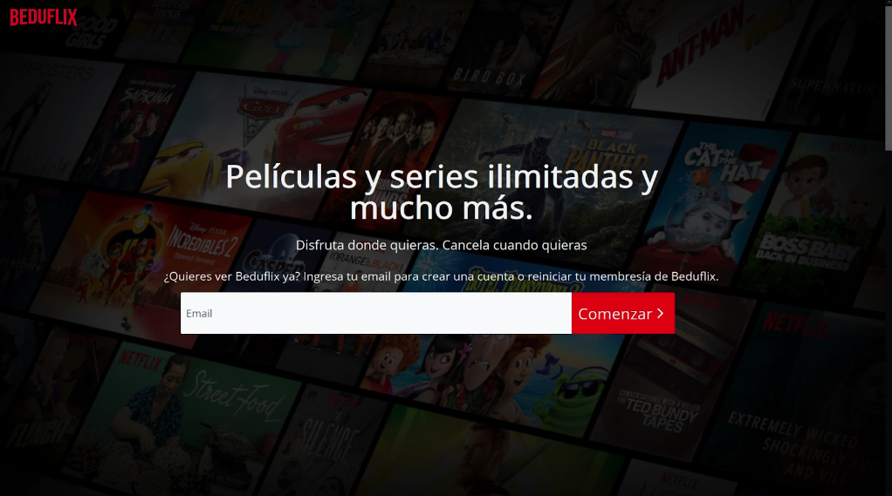

# wd-python-django-netflix-clone

## :wave: Welcome

A web development project that utilizes the Python programming language and the Django web framework to create a clone of the popular streaming service, Netflix. 
 
## 💻 Description

his project aims to replicate the functionality and user experience of the original site, including features such as browsing and streaming video content, creating and managing user accounts, and recommending content based on viewing history.
## :gear: Packages & Requirements

- Django

## Preview

